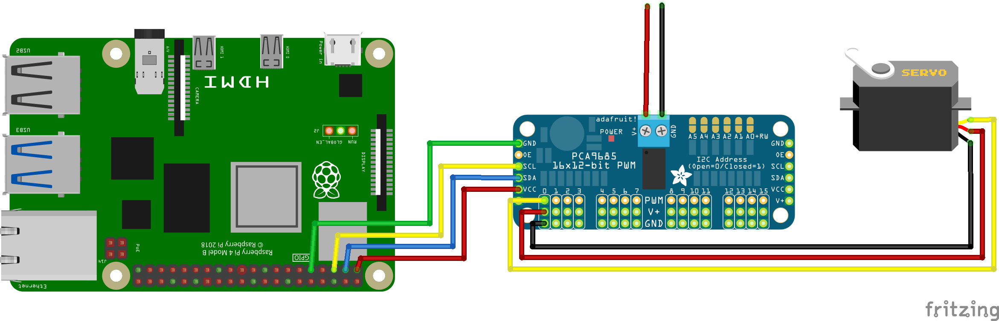

## Verify/detect the presence of a device on the I2C bus

```
pi@raspberrypi:~ $ i2cdetect -y 1
     0  1  2  3  4  5  6  7  8  9  a  b  c  d  e  f
00:                         -- -- -- -- -- -- -- -- 
10: -- -- -- -- -- -- -- -- -- -- -- -- -- -- -- -- 
20: -- -- -- -- -- -- -- -- -- -- -- -- -- -- -- -- 
30: -- -- -- -- -- -- -- -- -- -- -- -- -- -- -- -- 
40: 40 -- -- -- -- -- -- -- -- -- -- -- -- -- -- -- 
50: -- -- -- -- -- -- -- -- -- -- -- -- -- -- -- -- 
60: -- -- -- -- -- -- -- -- -- -- -- -- -- -- -- -- 
70: 70 -- -- -- -- -- -- --   
```

## Cross-compile the code for ARM architecture
NOTE: This step is automated in the VSCode task *cross: build (aarch64)*

```
user@host:~ $ export CROSS_CONTAINER_IN_CONTAINER=1
user@host:~ $ cross build --release \
                          --target aarch64-unknown-linux-gnu
```

## Copy files to rpi
NOTE: This step is automated in the VSCode task *Deploy to rpi*

```
user@host:~ $ scp target/aarch64-unknown-linux-gnu/release/i2c-test \
                  pca9685.yaml \
                  rpi:/var/tmp/
```

## Execute a test
```
pi@raspberrypi:~ $ export RUST_LOG=debug

# right-most angle for DS3218 20Kg servo on Channel 0
pi@raspberrypi:~ $ /var/tmp/i2c-test --config-file-path /var/tmp/pca9685.yaml \
                                     0 \
                                     0.5

# center angle for DS3218 20Kg servo on Channel 0
pi@raspberrypi:~ $ /var/tmp/i2c-test --config-file-path /var/tmp/pca9685.yaml \
                                     0 \
                                     1.5

# left-most angle for DS3218 20Kg servo on Channel 0
pi@raspberrypi:~ $ /var/tmp/i2c-test --config-file-path /var/tmp/pca9685.yaml \
                                     0 \
                                     2.5
```