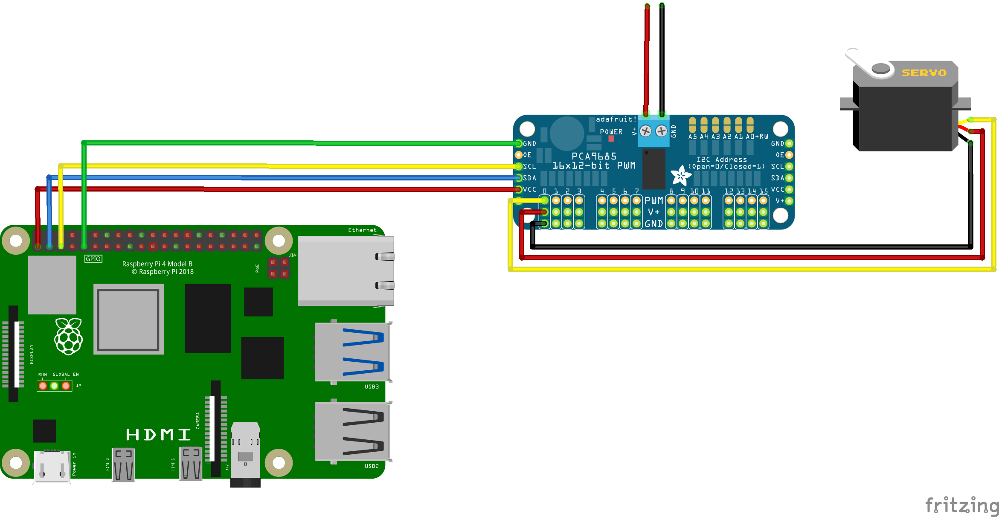

## Verify/detect the presence of a device on the I2C bus

```
pi@raspberrypi:~ $ i2cdetect -y 1
     0  1  2  3  4  5  6  7  8  9  a  b  c  d  e  f
00:                         -- -- -- -- -- -- -- --
10: -- -- -- -- -- -- -- -- -- -- -- -- -- -- -- --
20: -- -- -- -- -- -- -- -- -- -- -- -- -- -- -- --
30: -- -- -- -- -- -- -- -- -- -- -- -- -- -- -- --
40: 40 -- -- -- -- -- -- -- -- -- -- -- -- -- -- --
50: -- -- -- -- -- -- -- -- -- -- -- -- -- -- -- --
60: -- -- -- -- -- -- -- -- -- -- -- -- -- -- -- --
70: 70 -- -- -- -- -- -- --
```

## Cross-compile the code for ARM architecture
NOTE: This step is automated in the VSCode task *cross: build (aarch64)*

```
user@host:~ $ export CROSS_CONTAINER_IN_CONTAINER=1
user@host:~ $ cross build --release \
                          --target aarch64-unknown-linux-gnu
```

## Copy files to rpi
NOTE: This step is automated in the VSCode task *Deploy to rpi*

```
user@host:~ $ scp target/aarch64-unknown-linux-gnu/release/pca9685-* \
                  data/* \
                  rpi:/var/tmp/
```

## Execute a channel test
```
pi@raspberrypi:~ $ export RUST_LOG=debug

# right-most angle for DS3218 20Kg servo on Channel 0
pi@raspberrypi:~ $ /var/tmp/pca9685-channel-tester --config-file-path /var/tmp/pca9685.yaml \
                                     0 \
                                     0.5

# center angle for DS3218 20Kg servo on Channel 0
pi@raspberrypi:~ $ /var/tmp/pca9685-channel-tester --config-file-path /var/tmp/pca9685.yaml \
                                     0 \
                                     1.5

# left-most angle for DS3218 20Kg servo on Channel 0
pi@raspberrypi:~ $ /var/tmp/pca9685-channel-tester --config-file-path /var/tmp/pca9685.yaml \
                                     0 \
                                     2.5
```
## Test the server
```
pi@raspberrypi:~ $ export RUST_LOG=debug
pi@raspberrypi:~ $ export ROCKET_CONFIG=/var/tmp/rocket.toml
pi@raspberrypi:~ $ /var/tmp/pca9685-service --config-file-path /var/tmp/pca9685.yaml

# In another shell...
user@host:~ $ curl http://raspberrypi.local:9999/status
{"status":"HEALTHY","software":{"version":"1.1.0"}}

# NOTE: Channel may already be configured, depending on content of
#       /var/tmp/pca9685.yaml
user@host:~ $ curl -X POST \
                   -H "Content-Type: application/json" \
                   -d @data/channel_0_config.json \
                   http://raspberrypi.local:9999/channel

# right-most angle for DS3218 20Kg servo on Channel 0
user@host:~ $ curl -X PUT \
                   -H "Content-Type: application/json" \
                   -d @data/channel_0_pw_1.5ms.json \
                   http://raspberrypi.local:9999/channel/0

```

## Prepare the host (e.g., linux/amd64) to build for target architecture (linux/arm64)

```
user@host:~ $ sudo apt-get install -y qemu-user-static
.
.
.

user@host:~ $ qemu-aarch64-static --version
qemu-aarch64 version 6.2.0 (Debian 1:6.2+dfsg-2ubuntu6.6)
Copyright (c) 2003-2021 Fabrice Bellard and the QEMU Project developers

user@host:~ $ update-binfmts --version
binfmt-support 2.2.1

user@host:~ $ docker run --rm \
                         --privileged \
                         linuxkit/binfmt:ecd24b710cad869af6a4716809f62d7164286367

user@host:~ $ docker buildx ls
NAME/NODE     DRIVER/ENDPOINT STATUS  BUILDKIT PLATFORMS
default *     docker
  default     default         running 20.10.22 linux/amd64, linux/386, linux/arm64, linux/riscv64, linux/ppc64le, linux/s390x, linux/arm/v7, linux/arm/v6
```

## Build the image for the target architecture
NOTE: Requires `docker buildx` (experimental) and QEMU on the *host* (see above)

NOTE: This step is automated in the VSCode task *build docker image (arm64)*


```
user@host:~ $ docker buildx build --platform linux/arm64 \
                                  --tag ghcr.io/kerrys-learning-lab/pca9685-service:latest-arm64 \
                                  .
```

## Manually run the image on the Raspberry pi

```
pi@raspberrypi:~ $ docker run --rm \
                              -it \
                              -e RUST_LOG=debug \
                              -e ROCKET_CONFIG=/var/tmp/rocket.toml \
                              -v /var/tmp:/var/tmp \
                              -v /dev/i2c-1:/dev/i2c-1 \
                              --privileged \
                              -p 9999:9999 \
                              ghcr.io/kerrys-learning-lab/pca9685-service:latest-arm64 \
                                --config-file-path /var/tmp/pca9685.yaml
```
